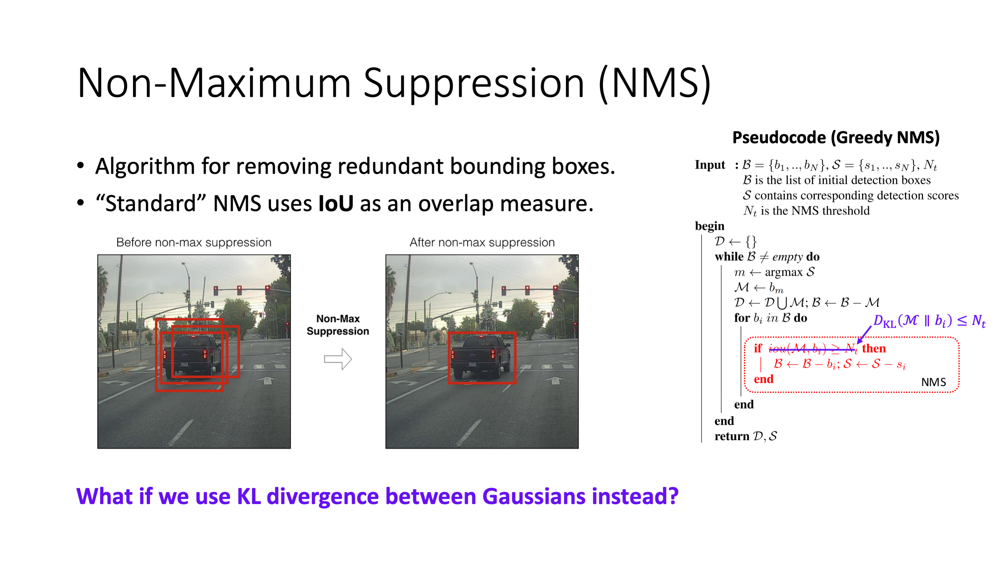
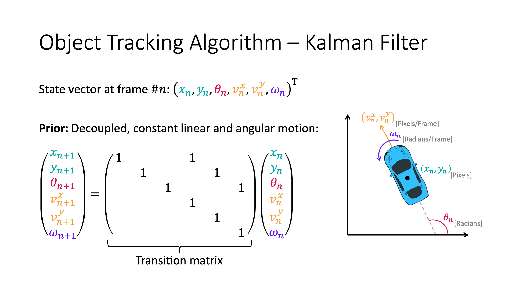
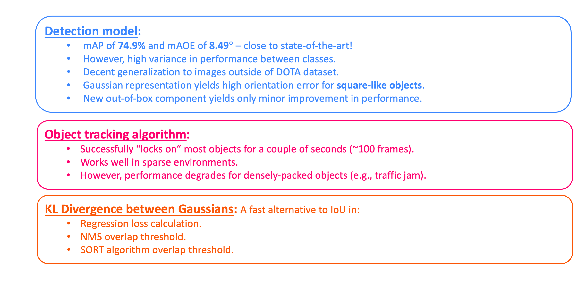

# Oriented Bounding Box

# Introduction

___

# Implemented Model Architecture

___

# Results

## Dataset - [DOTAv1.0](https://captain-whu.github.io/DOTA/dataset.html)

## Visual Results - Detection Model

## Qualitative Results - Detection Model

## Tracking Algorithm Results

[Example1](https://github.com/Lin-Sinorodin/OrientedBoundingBox/blob/gh-pages/assets/images/results/tracking_result_01.mp4)

[Example2](https://github.com/Lin-Sinorodin/OrientedBoundingBox/blob/gh-pages/assets/images/results/tracking_result_02.mp4)

___

# Conclusion

